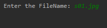
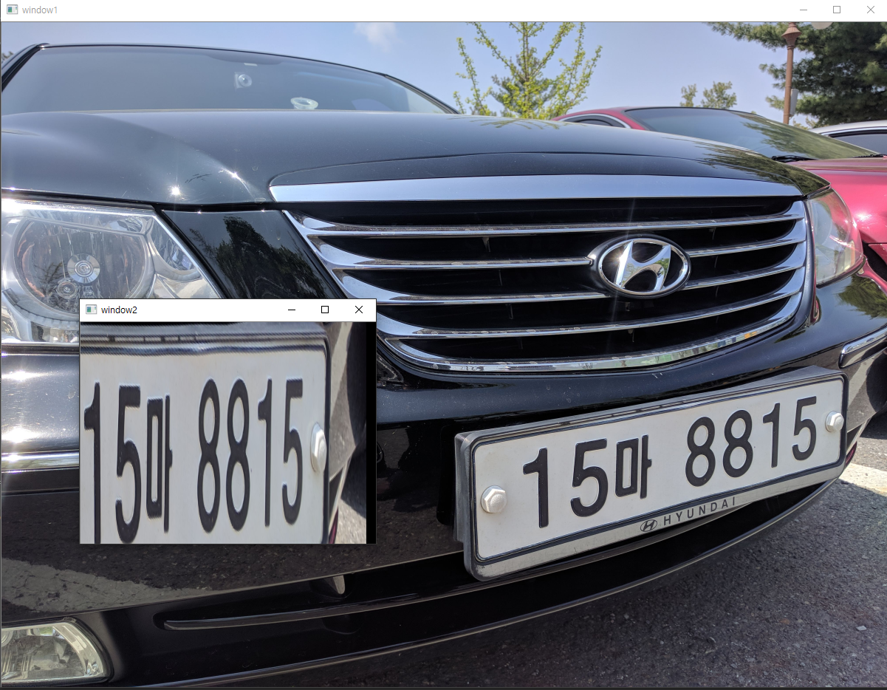

# opencv-car-number-plate-detection

자동차 번호판을 detection합니다.   

**주의**: oepncv 버전에 따라 다르게 해주어야하는 code가 있습니다.   

``` _,contours, _ = cv2.findContours(image, self.contourFind, self.contourExpress) ```   

이 부분은 버전에 따라 3개 또는 2개의 return vaalue가 옵니다.

문제가 발생하게 되면 다음의 코드로 변경해주세요.   
``` contours, _ = cv2.findContours(image, self.contourFind, self.contourExpress```   

코드를 실행하게되면 

   
다음과 같이 같은 경로에 있는 자동차 이미지들의 파일 이름을 입력해주세요   

   
해당 자동차의 번호판이 검출될 것 입니다.

**주의**: 해당 코드 특정 각도, 명암을 상정하고 만든게 아닙니다.   
만약 각도와 명암이 어느 정도 고정된 상황이라면 해당 코드를 변형해서 자동차 검출을 하는 것은 어렵지 않습니다.   

이 코드가 모든 자동차 번호판을 검출할 수 있는 것은 아닙니다.    
최대한 어떤 상황에서도 최선의 결과가 나오도록 만든 것이니 상황에 따라 코드를 변경해주시면 됩니다.   
